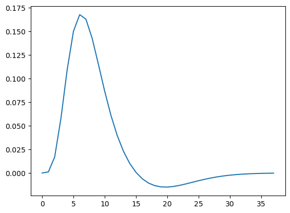

# ABCD Imaging

A key component of the ABCD Study involves several fMRI tasks administered to youth participants at baseline and every 2 years thereafter. 

Those tasks include:

* Monetary Incentive Delay (MID) Task (Knutson et al., [2000](https://doi.org/10.1006/nimg.2000.0593))
* Stop Signal Task (SST) (Logan [1984](https://psycnet.apa.org/record/1994-97487-005))
* Emotional N-Back Task (nBack) (Cohen et al., 2016b)

## Data Availability

Access to ABCD Data is managed by the [NIMH Data Archive (NDA)](https://nda.nih.gov/abcd/). 

### Fast-track Imaging Data
Along with basic participant demographics, imaging data including structural MRI, diffusion MRI, resting state fMRI, and task fMRI is released monthly in the form of raw DICOM files. 

### Minimally-processed Imaging Data
Raw imaging DICOM files are processed according to the steps described in Hagler et al. [2019](https://doi.org/10.1016/j.neuroimage.2019.116091). Functional preprocessing is described below.

### Tabular fMRI Data
Functional time-series images are pre-processed, sampled to the cortical surface, parcellated into regions of interest (ROI), and reported as estimates of activation strength using GLM Beta coefficients and standard errors. In most cases, these values are presented as fMRI subtraction-logic contrasts.

## fMRI processing (taken from Hagler et al. [2019](https://doi.org/10.1016/j.neuroimage.2019.116091))

### Preprocessing

The ABCD coordinators apply a standard set of preprocessing steps to all but the raw fMRI data. See Hagler et al. [2019](https://doi.org/10.1016/j.neuroimage.2019.116091) for details. Broadly:

* Head motion is corrected using AFNI's `3dvolreg`
    * This produces head motion time course estimates
* B0 distortion, distortions due to gradient nonlinearities, and between-scan motion is corrected
* Automated registration to T1w images

Resulting images are in "native-space" with 2.4mm isotropic resolution

### Pre-analysis processing

* Initial frames are removed
* Voxel time series are normalized by dividing by the mean across time of each voxel
* Each subject's pre-processed time course is sampled onto the cortical surface using FreeSurfer's `mri_vol2surf`

### Generating nuissance regressors
1. Motion estimates and their derivatives (tx, ty, tz, rx, ry, rz, dtx, dty, dtz, drx, dry, drz)
    * These are filtered using infinite impulse response (IIR) to attenuate signals associated with respiration (0.31-0.43 Hz). See Fair et al. [2018](https://doi.org/10.1016/j.neuroimage.2019.116400)
2. Censoring vector for images with framewise displacement (FD) > 0.9mm (i.e., 1 if censored, 0 otherwise)

### General linear model (GLM)
* Task-related strength is estimated using a GLM at the individual subject level (implemented using AFNI's `3dDeconvolve`)
* Hemodynamic response functions (HRFs) are modelled using a gamma variate basic function and its temporal derrivative. This is implemented in `abcd_hrf.py`

    

* Instantaneous events (MID, SST) or blocks (nBack) are convolved with the above HRF.

* GLMs are fit using for __each run__, obtaining a Beta coefficient and standard errors of the mean calculated from the ratio of Beta and the t-statistic __for each run__

* Beta and standard errors are averaged across imaging runs, weighted by the nominal degrees of freedom for each model (i.e., the number of non-censored frames minus the number of model parameters)
    * Runs with fewer than 50 degrees of fredom are excluded from the average between runs

* For ROIs, task contrasts are computed using subtraction logic.

* Censoring invalid contrasts:

    > We censor the beta and SEM values for all ROIs for those contrasts that have RMS of SEM values across the cortical surface greater than 5% signal change. This represents less than 0.5% of all subject-task-contrast-run combinations. The censored values are replaced with empty cells.

